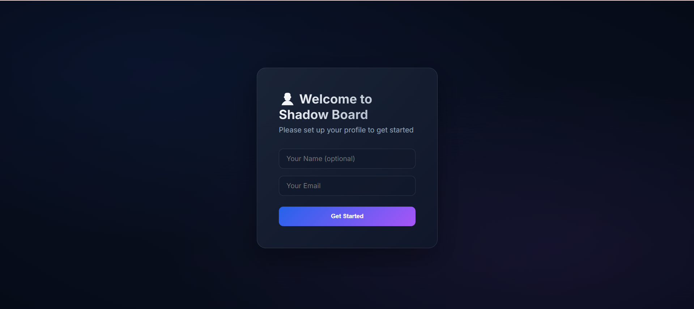
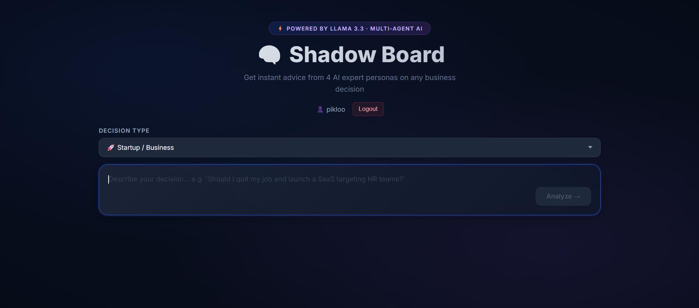

# 🧠 Shadow Board — Multi-Agent AI Advisory System

A real-time decision advisory platform powered by 4 specialized AI agents.
Type any business decision and get instant structured advice from multiple expert perspectives.

## 🎯 What It Does

- You enter a business decision
- 4 AI agents analyze it simultaneously
- Each agent has a different expertise and personality
- A 5th Consensus agent synthesizes everything
- You get a complete advisory report in seconds

## 👥 The 4 Agents

| Agent | Role |
|---|---|
| 🔴 Risk Analyst | Finds every risk and threat |
| 🟢 Growth Hacker | Finds every opportunity and upside |
| 🔵 Financial Hawk | Analyzes costs, revenue, ROI |
| 🟡 Devil's Advocate | Challenges every assumption |

## 🛠️ Tech Stack

- **Frontend:** React.js
- **Backend:** Node.js + Express
- **AI:** Groq API (LLaMA 3.3 — free)
- **Deployment:** Vercel (frontend) + Render (backend)

## 🚀 Quick Start

### 1. Clone the repo
```bash
git clone https://github.com/yourusername/shadow-board.git
cd shadow-board
```

### 2. Setup Backend
```bash
cd backend
npm install
cp .env.example .env
# Add your Groq API key to .env
npm run dev
```

### 3. Setup Frontend
```bash
cd frontend
npm install
npm start
```

### 4. Open in browser
http://10.129.143.116:3000

## 📸 Screenshots




## 📁 Project Structure
shadow-board/
├── backend/         # Node.js + Express API
├── frontend/        # React application
├── docs/            # Documentation
└── screenshots/     # UI screenshots

## 📄 License
MIT License — free to use and modify.